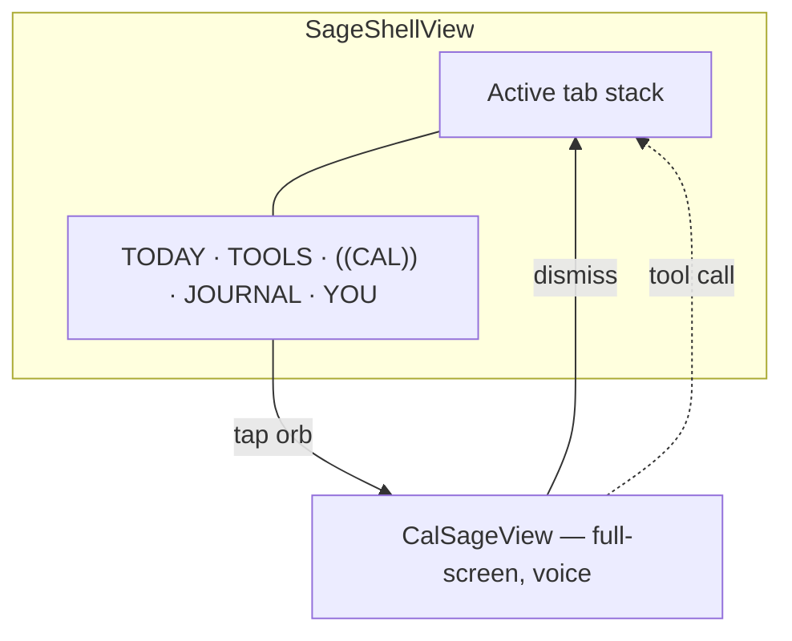
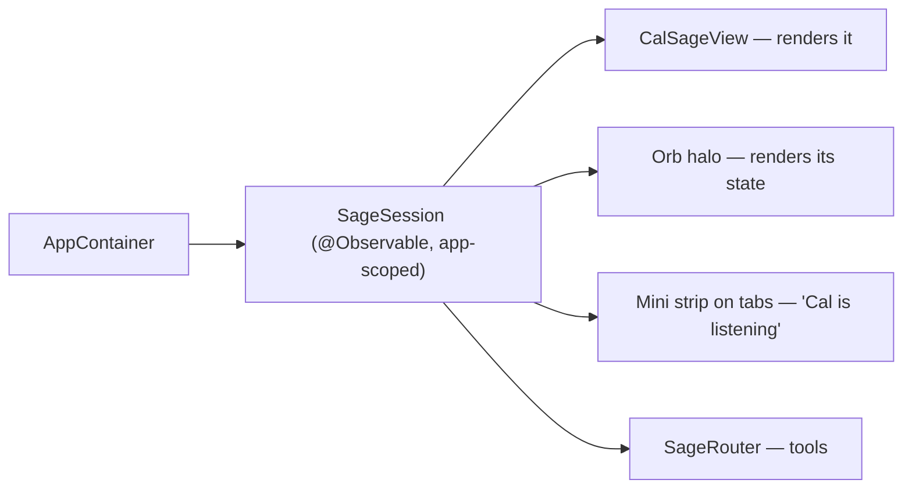
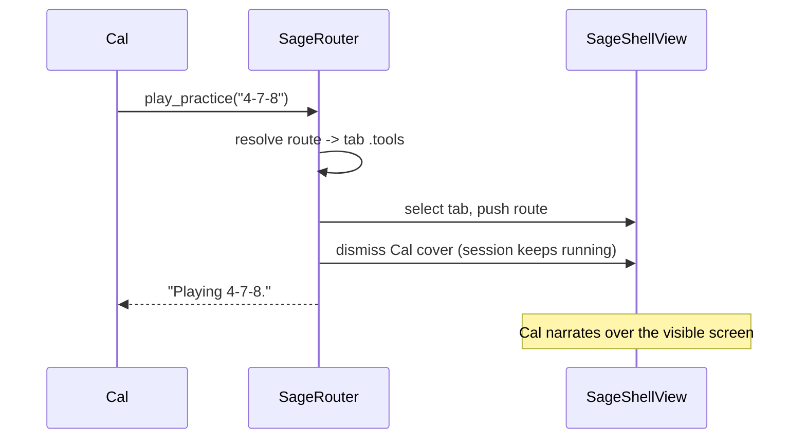
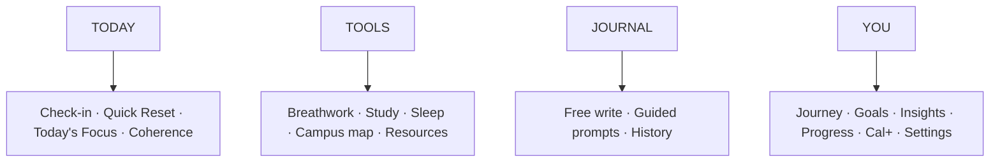
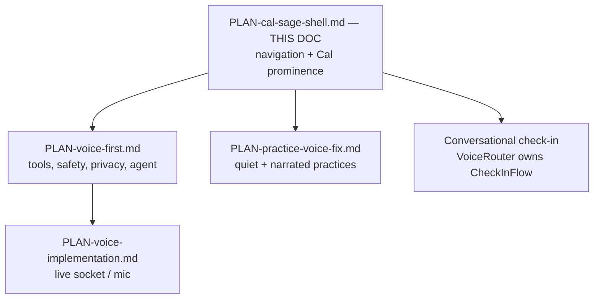

# Plan — Cal Sage AI in the center

Dr. Mia's blueprint has five tabs with **COACH** as the middle one.
`PLAN-voice-first.md` deleted the tab bar and made Cal the root. This plan takes
the third position: **the tab bar comes back, and Cal Sage AI *is* the middle
slot** — not a chat tab, a raised orb that owns the voice companion.

Voice stays the headline. The tabs are the places Cal takes you, and the places
you can reach yourself when you don't want to talk.

---

## 1. The shell

The orb replaces COACH, so the blueprint's five slots survive: four tabs plus
Cal. It is visually raised, larger than the tab items, and the one element that
reads as the product — **Cal Sage AI**, not another destination in a row of five.

`VoiceRootView` becomes `CalSageView` and is presented as a full-screen cover
rather than being the root. Nothing inside it changes materially: Cal, halo,
transcript, `type-instead`, `emergency-button`, `FailureCard`.

---

## 2. The session outlives the cover

This is the load-bearing change. Today `VoiceRootViewModel` is created in
`VoiceRootView.task` and stopped when the view goes away. If the cover owns the
session, dismissing it hangs up on Cal mid-sentence.

| Rule | Why |
|---|---|
| One session per app run, owned above the shell | Dismissing the cover must not end the call |
| Orb halo mirrors `VoiceSessionState` | The state read is the point of the orb |
| `scenePhase == .background` still stops it | Same mic and billing argument as before |
| Mini strip on non-Cal tabs while live | Cal talking from behind a screen needs to be visible |

---

## 3. What happens when Cal moves the screen

`VoiceRouter` currently appends to one `[VoiceRoute]`. With tabs there are four
stacks, so a tool has to pick a tab *and* push, then get out of the way.

Route → tab, one place, unit-tested without a simulator:

| Route | Tab |
|---|---|
| `checkIn`, `practice` | TODAY |
| `practices`, `navigate`, `planner`, `study` | TOOLS |
| `journal` *(new)* | JOURNAL |
| `history`, `progress`, `settings`, `premium` | YOU |

`SageRouter` keeps `perform(_:) -> ToolResult` unchanged, so `CalVoice` and its
tests don't move. Only the destination changes: `selection` plus
`stacks[tab].append(route)` instead of one flat array.

---

## 4. Tabs, mapped to what exists

| Blueprint | Code today | Work |
|---|---|---|
| TODAY | `HomeView` (orphaned since voice-first) | Re-adopt as tab root, add Quick Reset row |
| TOOLS | `PracticesLibraryView`, `NavigateView`, `PlannerView`, `StudyTimerView` | New hub screen of cards over existing views |
| JOURNAL | **nothing** | New feature: model, store, views. Largest gap in the blueprint |
| YOU | `HistoryView`, `AnalyticsView`, `SettingsView`, `PaywallView` | New dashboard screen linking them |
| Sacred Care Fund | nothing | Under TOOLS; nonprofit path, needs Dr. Mia |

---

## 5. Decisions

| Question | Answer |
|---|---|
| Is COACH still a tab? | No. It is the orb. Five slots, middle one is Cal Sage AI. |
| Where does launch land? | On Cal, cover up. Dismiss reveals TODAY. Voice is the default, not a detour. |
| Does the orb start a session? | Tap opens the cover and connects if idle. No separate connect step. |
| Emergency | Header item on every tab root *and* in the cover. `emergency-button` identifier unchanged. Never behind a network check. |
| Typed chat | Stays reachable from the cover (`type-instead`) and from Cal's mini strip. |
| Cal's visual modes | Deferred. `CalAvatar` gains a mode later; not a shell concern. |

Unresolved, flagged rather than assumed:

- **Dr. Mia has not seen this either.** It restores her navigation and moves her
  COACH tab. Better news than "the tabs are gone", still hers to approve.
- **Journal is net-new scope**, and it is where AI-assisted reflection lives —
  which touches consent (`PLAN-voice-first.md` §8), not just UI.
- **Product name in chrome.** Specs say Cal; Dr. Mia says "Cal Sage AI." Decide
  whether the orb label, accessibility string, and marketing string match, or
  whether "Cal" stays short in UI and "Cal Sage AI" is the spoken/brand name.

---

## 6. Cleanup — mid-flight voice-first debt

You stopped with Cal as the *only* root. The shell plan reintroduces tabs without
throwing away the voice stack. Clean the arrangement; keep the companion.

### Keep (still load-bearing)

| Piece | Why |
|---|---|
| `Packages/CalVoice` | Tools, validation, `MockVoiceSession`, safety monitor |
| `VoiceRootView` / `VoiceRootViewModel` | Becomes `CalSageView` + app-scoped session |
| `VoiceRouter` + `CalToolPerforming` | Becomes `SageRouter` with tab+stack destinations |
| `ElevenLabsVoiceSession`, `voice-token`, agent files | Live path; independent of shell |
| `get_today_status`, map/`show_place`, open screens | Already useful under either shell |
| Crisis interrupt path on transcripts | Must survive the cover/session lift |

### Stop treating as current architecture

| Piece | Action |
|---|---|
| `RootView` = single stack on `VoiceRootView` | Replace with `SageShellView`; `RootView` becomes a thin host |
| "Tabs are gone" comments in `RootView`, `VoiceRootView`, plans | Rewrite against this doc |
| `PLAN-voice-first.md` §1 / §5 / §9 step 2 as *the* shell decision | Superseded here for navigation; keep §3 tools, §7 safety, §8 privacy/cost |
| Conversational check-in on `VoiceRouter` | **Paused.** Still stubs (`record_score` honest failure). Do not finish under the old single-stack assumption — own a `CheckInFlow` only after the shell owns tabs |
| `PLAN-practice-voice-fix.md` | Still needed, but after shell: practice must land on TOOLS/TODAY while the session stays alive behind the cover |

### Orphaned / half-rewired surfaces

| Surface | State | Cleanup |
|---|---|---|
| `HomeView` | Still in the target, not on any path | Re-adopt as TODAY root; drop or relocate the "tabs gone" watermark assumptions |
| `CalUITests` | Still drive `Home` / `Check-In` / `Navigate` / `Planner` / `Chat with Cal` | Will fail against voice-root *and* against the new labels. Rewrite once for TODAY · TOOLS · orb · JOURNAL · YOU — do not rewrite twice |
| Previews in `RootView` | Scripted voice-root only | Add shell + cover previews; keep mock scripts |
| Menu-only destinations on voice root | Temporary escape hatch while tabs were gone | Remove once tabs return; avoid two ways to every screen |

### Doc / plan hygiene (do once, early)

1. Mark `PLAN-voice-first.md` §1 decision **"five tabs gone"** as superseded by
   this plan (keep a one-line pointer at the top of that file).
2. Do not start a sixth competing PLAN. Expand this file when shell decisions
   change.
3. Leave `PLAN-brand-and-chat.md` alone until the shell lands — it still talks
   about applying tokens to the old tab bar.

### Explicitly do *not* clean yet

- Delete `CalVoice`, agent deploy scripts, or `ElevenLabsVoiceSession` — the
  companion vector is the point.
- Finish `record_score` / `CheckInFlow` on VoiceRouter before the shell exists —
  you would wire it to a navigation model you are about to replace.
- Build JOURNAL in the same pass as the orb — net-new product, separate plan.

---

## 7. Order

1. **Freeze conversational check-in and practice-narration work** until the
   shell owns routing. Document the freeze in `VoiceRouter` comments so the next
   session doesn't resume the wrong stack.
2. `SageShellView` + orb + `SageRouter` tab mapping, against `MockVoiceSession`.
   Tabs can be stubs; the shell and the routing are the design question.
3. Lift the session to `SageSession` above the shell. Prove dismissing the cover
   doesn't hang up; prove the orb halo mirrors state.
4. `CalSageView` = today's `VoiceRootView`, presented as a cover. Launch with
   cover up.
5. TODAY and YOU from existing screens (`HomeView`, history/analytics/settings).
6. TOOLS hub over existing screens.
7. Rewrite `CalUITests` entry points for the new bar (once).
8. Resume deferred voice work on the new router: practice quiet/narration, then
   conversational check-in.
9. JOURNAL, last and separately planned.

Steps 2–4 are the redesign. Everything after is filling tabs or finishing the
companion features that were already in flight.
