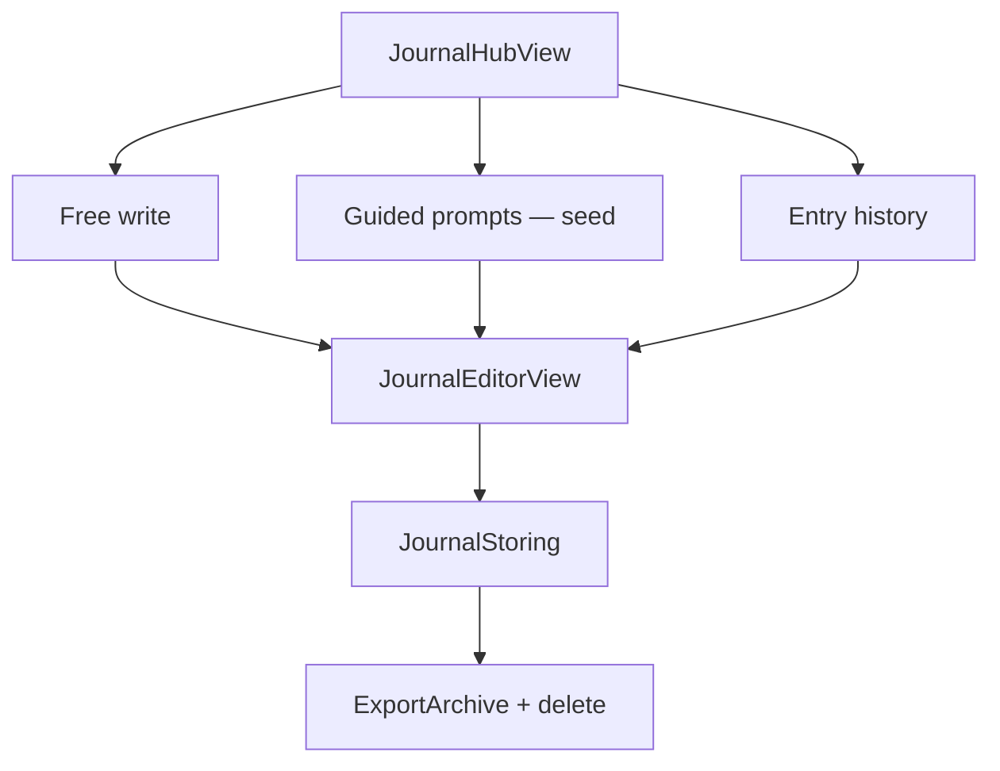

# Plan — JOURNAL tab

Net-new product for the sage shell (`PLAN-cal-sage-shell.md` §4, §7 step 9).

## This pass (local MVP)

| Piece | Notes |
|---|---|
| `JournalEntry` / `JournalPrompt` in `CalKit` | Pure domain; prompts are a compiled seed |
| `JournalStoring` in `CalData` | SwiftData + in-memory; same container as check-ins |
| Hub UI | Free write · Guided prompts · History |
| Export / delete | Archive gains `journalEntries`; format version 2 |

Free write is **not** gated. Their own words are their data (`PremiumFeature.neverGated`).

## Deferred

| Piece | Why |
|---|---|
| AI reflection (`CoachClient.journalReflection`) | Consent + memory gate (`PLAN-voice-first.md` §8); premium feature |
| Sync conflict rule | ARCHITECTURE §15: never silently overwrite an unsynced local body |
| Cal tools / voice open journal | After the tab is real |

## Build order

1. Model + store + tests
2. Export / delete / `AppContainer`
3. Hub + editor; replace journal stub
4. UITest identifier `journal-root`
