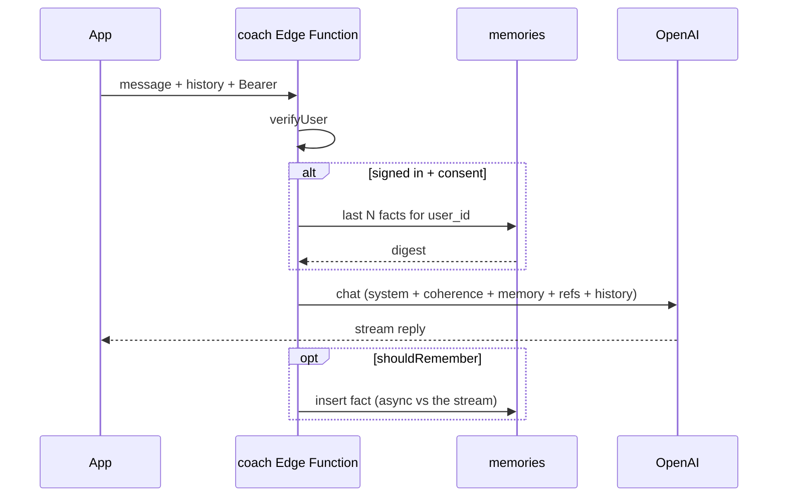
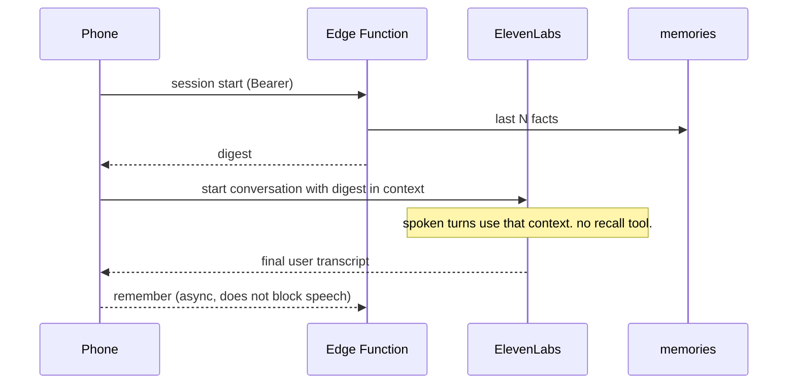
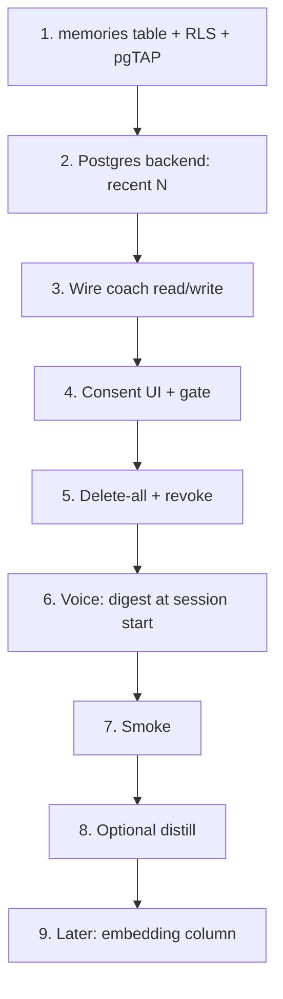

# Plan — User-specific memory for Cal

Own a small **Postgres fact table**. Chat and voice share it. ElevenLabs only
**consumes** a digest at session start — it is not the store.

v1 is standing facts (recency), not embeddings. pgvector is a later upgrade if
“what did I say about X?” fails because X aged out of the digest.

Do **not** put an OpenAI key in the app. Do **not** put student facts in an
ElevenLabs knowledge base.

---

## Decisions (locked)

- Store: Supabase `memories`, not Chroma, not ElevenLabs.
- One table for typed chat and voice.
- Writes after the turn, never on the spoken hot path.
- Voice recall is a **prefetch digest**, not a client/server tool mid-sentence.
- Consent is a second yes (`MemoryConsent`). Writes stay dark for real students
  until counsel replaces the copy (`memory.ts` header / LAUNCH §18).
- Keep `shouldRemember` / `isDurable` / optional distill (M3). Keep fenced
  untrusted memory in `assemble.ts`.
- `PersonalMemory` stays the API; swap the backend. Recency query first;
  cosine search later, same rows.

---

## Turn shapes

### Chat — retrieve is last N facts, write is after the reply



### Voice — digest in at start, remember after the transcript



Anonymous / no consent / DB error → same coach, no memory block (fail open).

---

## Ship order



### 1. Schema

New migration. Do not edit the original table/RLS files.

```sql
create table public.memories (
  id         uuid primary key default gen_random_uuid(),
  user_id    uuid not null references auth.users (id) on delete cascade,
  text       text not null,
  created_at timestamptz not null default now(),
  updated_at timestamptz not null default now()
);

create index memories_user_created_idx
  on public.memories (user_id, created_at desc);
```

No `embedding` column in v1.

**Write policy:** same as `ai_usage`. Client may `SELECT` own rows (Settings:
what Cal remembers). Insert/update/delete are **service_role only**. A client
that can insert can poison its prompt; a client that can delete can wipe what
was stored.

Add `memories` to the pgTAP catalogs: RLS on, no client-writable policy,
cascade on `auth.users` delete, isolation across two users.

### 2. Backend

Implement `MemoryBackend` against Postgres.

| Method | v1 |
|---|---|
| `query` | `select text, created_at from memories where user_id = $1 order by created_at desc limit N` |
| `upsert` | insert the durable fact |
| `deleteAll` | `delete from memories where user_id = $1` |

N ≈ 10 for the digest, then the existing `MEMORY_TOP_K` (3) can still cap what
reaches the prompt if the assembly wants a tighter block.

Dedupe: skip insert when normalized text matches a recent row for that user
(cheap string compare). Do not wait on vector distance.

Use the function’s **service_role** client; always pass verified `user.id`
(`identity.ts`) — never a body-supplied profile id.

Fail open: errors log and return empty / false. Coach still answers.

Stop gating personal memory on `CHROMA_URL`. Leave `ChromaMemoryBackend` unused.
Do not run two personal stores. Shared content retrieval (`cal_content`) can
keep using Chroma.

### 3. Chat wiring

- Signed-in + `permitsRemoteMemory` → send Bearer (`verifyUser`).
- Not granted → no recall, no write, even if signed in.
- Fill the existing fenced memory block in `assemble.ts` with the digest.
- Only chat turns the function already receives. Store stays server-side.
- Remember runs after `shouldRemember`; do not delay the first streamed token
  on the insert.

### 4. Consent

Memory is a **second yes**, not bundled into sign-in.

- Settings using `MemoryConsentCopy` (or counsel replacement).
- Persist grant/revoke; bump `currentVersion` when copy changes → re-prompt.
- Voice already sends audio to ElevenLabs (`PLAN-voice-first.md` §8). Before
  voice memory ships, rewrite `sharingNote` / Chat-only wording and bump past
  `memory-v1`.
- Until counsel replaces copy: **do not enable the write path for real students.**

### 5. Erasure

- Account delete: cascade on `user_id`.
- Consent revoke / “forget me”: `PersonalMemory.forgetEverything` (same
  `PersonalDataService` path as on-device wipe).
- Revoke also stops new writes.

### 6. Voice

Same table. No second store. No `recall_memories` tool.

On orb open / token mint: load the digest once, inject as ElevenLabs dynamic
variables or conversation-initiation context. Cal speaks immediately.

Writes: on final user transcript, if consent and not crisis, POST remember.
Fire-and-forget.

Optional later: refresh the digest in the background for the **next** session,
never the current sentence.

### 7. Acceptance checks

- Durable fact → new chat thread includes it in the digest.
- New voice session starts with that digest; first spoken turn does not wait
  on a retrieve tool.
- Question / crisis-severity → not stored.
- Near-duplicate text → skipped.
- Other user’s rows never returned (pgTAP + coach-level test).
- `deleteAll` → digest empty.
- DB error → coach / voice still run.

### 8. Distillation (optional)

`CAL_DISTILL_MODEL` after measuring cost vs §10.5. Unset = store durable raw
text (`isDurable` still applies). Never on the voice hot path.

### 9. Later — embeddings

Only if recency misses facts the student is asking about.

Add `embedding vector(1536)` (nullable), fill **async after insert**, HNSW
cosine. Chat may switch `query` to k-NN. Voice still uses a prefetch digest —
never mid-turn embed + tool.

Keep `CAL_EMBED_MODEL` as an explicit contract when that column lands.

---

## What already exists

| Layer | Status |
|---|---|
| `vector` extension | On (unused by v1 memory) |
| `PersonalMemory` / M3 / fenced assembly | Built; Postgres recency for personal facts |
| `MemoryConsent` (`memory-v1`) | Built; copy is Chat-only |
| App consent gate + hosted write path | Plumbing in; writes stay dark for real students |

---

## Out of scope

- Migrating `cal_content` off Chroma.
- Persisting chat threads (`PLAN-brand-and-chat.md` §5).
- Server classifier / budgets / kill switch.
- Using memory to invent scores or override crisis routing.
- ElevenLabs built-in / knowledge-base memory.
- Blocking recall tools on the spoken turn.
