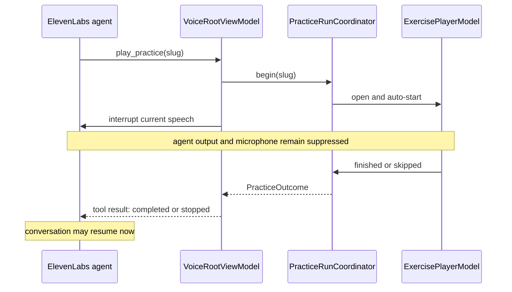
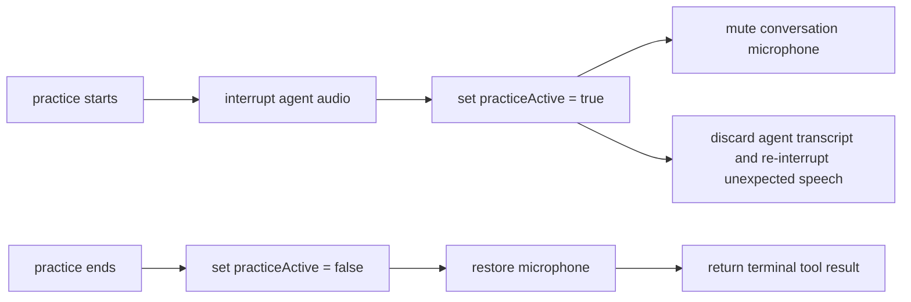
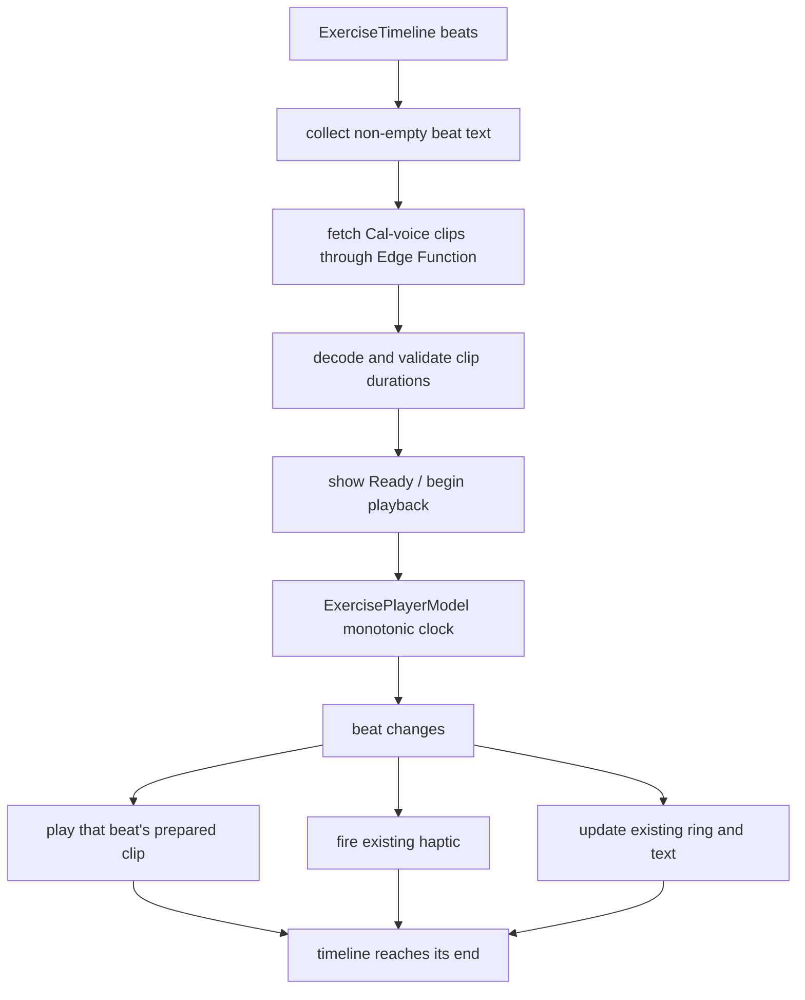

# Plan — quiet Cal, narrated practices

Two defects share one missing boundary:

- `play_practice` returns as soon as the screen opens, so the agent believes the
  practice is already done and continues talking.
- `ExercisePlayerModel` drives visuals and haptics only; its authored beat text
  is never spoken.

The practice timeline remains the clock. The language model never decides when a
cue plays or when the practice ends.

## 1. Practice lifecycle

`play_practice` must remain pending until the player reports a terminal outcome.
Increase that tool's ElevenLabs response timeout to the longest authored
practice plus a startup margin. Other tools keep their short timeout.

Add `PracticeRunCoordinator` as the single owner of:

- active run ID and exercise slug;
- `running`, `completed`, or `stopped` state;
- the continuation awaited by `VoiceRouter.perform(.playPractice)`;
- idempotent resolution, so finish, skip, dismissal, and cancellation cannot
  resume the agent twice.

`PracticeRunnerView` reports `.completed` from `onFinished` and `.stopped` from
skip or dismissal. `stop_practice` stops the active player through the
coordinator rather than only removing a navigation route.

## 2. Silence is enforced in code

Prompt instructions remain a second layer, not the control.

Extend the vendor-neutral `VoiceSession` boundary with practice suspension and
resumption operations. In `ElevenLabsVoiceSession`:

- interrupt any sentence already in flight;
- mute microphone capture during the practice;
- suppress transcript events and immediately interrupt unexpected agent speech;
- restore the previous microphone state only after the player ends.

Emergency remains independent and available throughout.

## 3. Narration follows the existing clock

Add a server-side `practice-audio` Edge Function. It holds the ElevenLabs key and
accepts authored cue text; the app never receives a provider credential.

Add `PracticeNarrationClient` and `PracticeNarrator` in the app:

- prepare clips before the timeline starts, in parallel and deduplicated by
  exact text;
- use Cal's configured ElevenLabs voice;
- cache by voice ID + model + text hash;
- play each clip once when its beat ID becomes active;
- stop audio immediately on skip, dismissal, interruption, or route change.

Do not stream free-form agent speech into the exercise. Every spoken word comes
from `ExerciseTimeline.Beat.text`.

If a generated clip is longer than its beat, preparation fails visibly instead
of overlapping the next instruction or changing the breathing clock. For the
demo, offer retry or a clearly labelled silent/haptic fallback; never start a
partially prepared narrated practice.

## 4. Audio behavior

- Use one `.playAndRecord` / `.spokenAudio` session shared with ElevenLabs.
- Pause on phone-call interruption and resume from a newly anchored monotonic
  start so audio, ring, and haptics stay aligned.
- Pause when headphones disconnect; do not continue through the speaker.
- With VoiceOver running, suppress practice narration so it does not speak over
  VoiceOver announcements.
- Keep narration and haptics independently configurable.

## 5. Verification

Unit tests:

- `play_practice` does not return before `.completed` or `.stopped`;
- completion resolves exactly once;
- `stop_practice` stops the player and returns `.stopped`;
- every non-empty beat gets exactly one prepared clip;
- a clip longer than its beat rejects preparation;
- repeated beat text is synthesized once but scheduled at every matching beat;
- narration stops on skip and never fires after completion.

Session tests:

- starting a practice interrupts Cal and mutes the microphone;
- agent transcript/speaking events are suppressed while active;
- completion restores the microphone before returning the tool result;
- crisis interruption and Emergency still work during a practice.

Device acceptance:

1. Ask Cal to start a practice.
2. Close your eyes.
3. Hear every authored cue at its beat boundary.
4. Hear no conversational Cal during the practice.
5. Finish or skip.
6. Only then hear Cal resume and ask how it felt.

## Build order

1. Add `PracticeRunCoordinator`; make `play_practice` await the real outcome.
2. Enforce session suspension/resumption and extend the tool timeout.
3. Add the `practice-audio` function and narration client.
4. Drive narration from beat changes in `ExercisePlayerModel`.
5. Add interruption, route-change, VoiceOver, and device tests.
