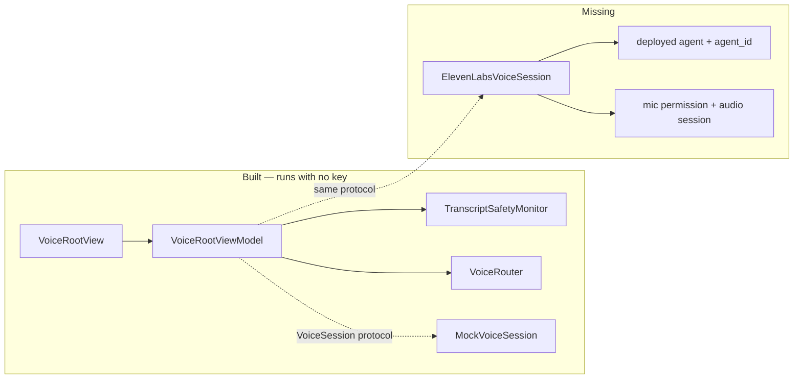
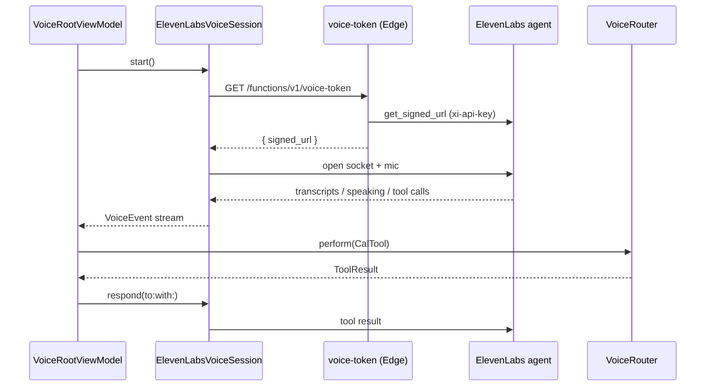
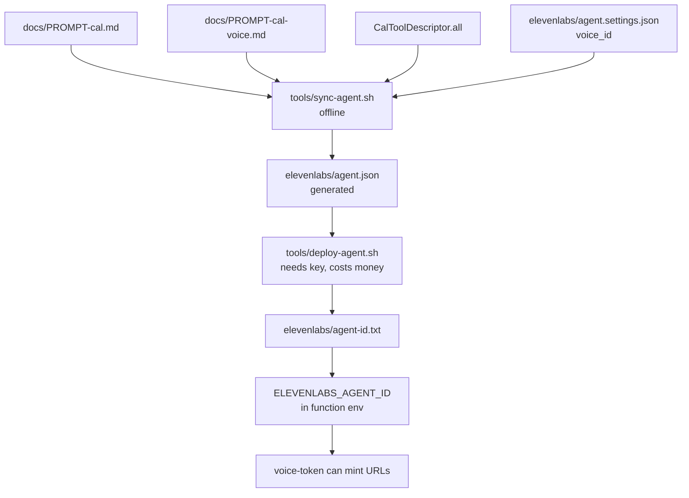

# Plan — making Cal's voice real

`PLAN-voice-first.md` decided the architecture and steps 1–3 of its §9 are built:
the tool layer, the router, `VoiceRootView`, the agent-as-a-file scripts, and the
`voice-token` function all exist and run against `MockVoiceSession`.

This is step 4 and what step 4 drags in with it: the first real socket, the first
microphone, the first dollar.

---

## Where the gap is



Nothing above the protocol changes. The work is one conformance, one deploy, and
the platform obligations that come with an open microphone.

---

## Runtime path, once live



The key never leaves the Edge Function. The phone only ever holds a short-lived
signed URL.

---

## Config path, before any of that works



---

## Order

### 1. Deploy the agent

`voice_id` in `agent.settings.json` is still `REPLACE_ME` and `deploy-agent.sh`
refuses to run until it isn't. The ElevenLabs voice already exists — this is
transcription, not a decision.

```bash
# set voice_id in elevenlabs/agent.settings.json first
./tools/sync-agent.sh
export ELEVENLABS_API_KEY=…          # same value as supabase/functions/.env
./tools/deploy-agent.sh
```

Commit `agent-id.txt` and `deployed.json` — they are the only record of which Cal
is answering the phone.

**Note:** `ELEVENLABS_VOICE_ID` in `supabase/functions/.env` is read by nothing.
The voice is baked into the agent at deploy time; the function only needs the key
and the agent id. Either delete it or leave it as a comment, but don't build on it.

### 2. Point `voice-token` at the agent

`voice-token/index.ts` reads `ELEVENLABS_AGENT_ID` and returns `voice_unconfigured`
(503) without it. Add it to `supabase/functions/.env` after step 1, and to the
hosted project's secrets before anything runs off a laptop.

Prove it before writing Swift:

```bash
supabase functions serve --env-file supabase/functions/.env --no-verify-jwt
curl -s localhost:54321/functions/v1/voice-token
```

A `token` in the response means the entire server half is done. (Voice uses a
WebRTC conversation token from `/v1/convai/conversation/token` — not a signed
WebSocket URL; those are text-only in the ElevenLabs Swift SDK.)

### 3. Give the app the endpoint

`BackendConfiguration.Backend` exposes `coachEndpoint`; add `voiceTokenEndpoint`
the same way. Same reason the coach one is there — the local stack and the hosted
project have to be switchable without editing code.

### 4. `ElevenLabsVoiceSession`

**It does not go in `Packages/CalVoice`.** That package's header states the rule:
no SwiftUI, no AVFoundation, no WebSocket, so `swift test` never needs a device.
The live session goes in the app target next to the view it serves —
`Cal/Features/Voice/ElevenLabsVoiceSession.swift`.

Its whole job is translation:

| Their side | Our side |
|---|---|
| socket open / closed | `.connecting`, `.connected`, `.ended` |
| user transcript, partial + final | `.userTranscript(_, isFinal:)` |
| agent transcript, partial + final | `.agentTranscript(_, isFinal:)` |
| agent audio start / stop | `.agentSpeaking(Bool)` |
| client tool invocation | `.toolCall(VoiceToolCall)` — **undecoded** |
| 401 on the signed URL | `.failed(.authenticationFailed)` |
| socket drop | `.failed(.connectionLost(willRetry:))` |
| mic denied / busy | `.failed(.microphonePermissionDenied / .microphoneUnavailable)` |

Two things to hold to:

- **Pass tool calls through raw.** `CalTool.init(_:)` is the single trust
  boundary and it is already tested. Decoding early duplicates it in an untested
  place.
- **Failures are events, not thrown errors**, per `VoiceSession`'s contract. The
  distinctions in `VoiceFailure` are the difference between telling someone to
  check their wifi and telling them Cal is misconfigured.

**Open decision:** ElevenLabs' Swift SDK vs. a raw WebSocket. The SDK brings mic
capture, playback and barge-in, which is most of the risk in this step; a raw
socket means owning audio I/O. Recommend the SDK, adapted behind the protocol so
the dependency stops at this one file.

### 5. Microphone and audio session

Non-negotiable before a device build:

- `NSMicrophoneUsageDescription` in `Cal/Info.plist` — absent today. The app
  crashes on first mic access without it.
- `AVAudioSession` `.playAndRecord` / `.spokenAudio`, plus interruption and
  route-change handling. A phone call must pause and resume; headphones out must
  not broadcast a therapy session to a room.
- `UIBackgroundModes: audio` is already there for breathwork. Voice inherits it,
  which makes `VoiceRootView`'s existing `scenePhase == .background` teardown the
  only thing stopping a backgrounded microphone. Verify it on a device.

### 6. Cost controls, same pass

`PLAN-voice-first.md` §8 is still true: no budget, no rate limit, no kill switch.
A live session bills per minute and has no natural end.

Minimum for a demo:

- Client-side hard session cap → `VoiceFailure.sessionLimitReached`, which
  already exists and already has non-blaming copy.
- Kill switch that is not "undeploy the function" — an env flag `voice-token`
  checks and returns `voice_unconfigured` on.

The client cap is a courtesy, not a control. Anyone who can reach the function
can open sessions; that is a real hole and it should be named as one until it's
per-user metered.

### 7. Safety against a real transcript

`TranscriptSafetyMonitor` is wired and tested against scripted mocks. Against a
live stream one decision is still open: whether acute patterns act on
`isFinal: false` partials. Earlier trigger, more false positives — and the cost
matrix is asymmetric by design.

Test the interrupt on a device before the demo. It is the one path nobody gets to
debug live.

---

## Not in this pass

- **Practice narration** (§6). The timeline stays the clock; synthesise-at-start
  is separate work and breathwork works today without it.
- **Conversational check-in** (§4). It writes data and it needs Dr. Mia.
- **Consent and privacy** (§8). `MemoryConsentCopy.sharingNote` is false the
  moment a student's voice reaches ElevenLabs. `MemoryConsent.currentVersion`,
  `PrivacyInfo.xcprivacy` audio declaration, and the sub-processor entry are
  required before anyone outside the room uses this — not before you do.
